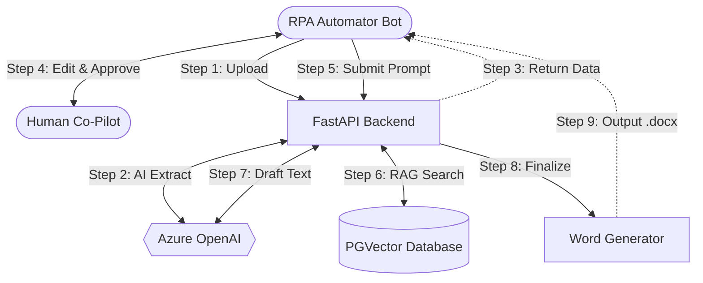
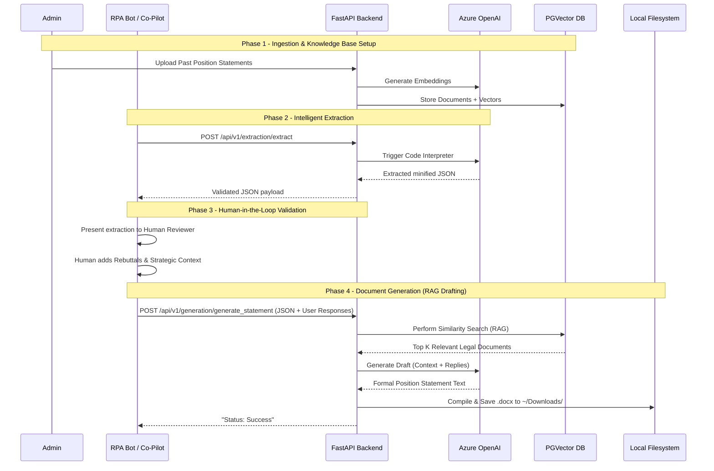
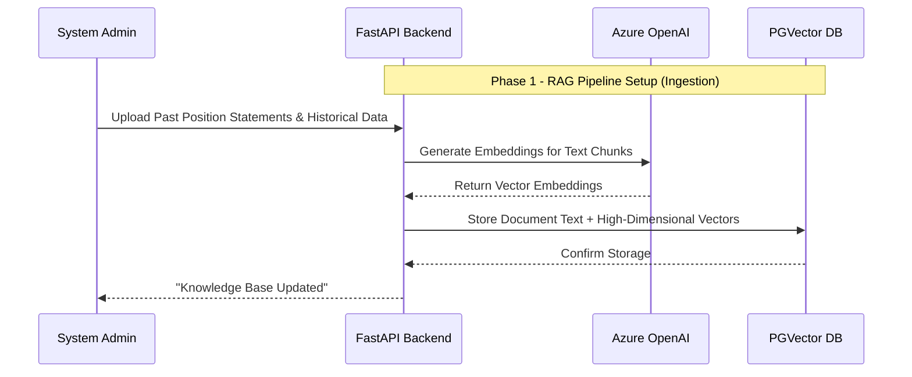
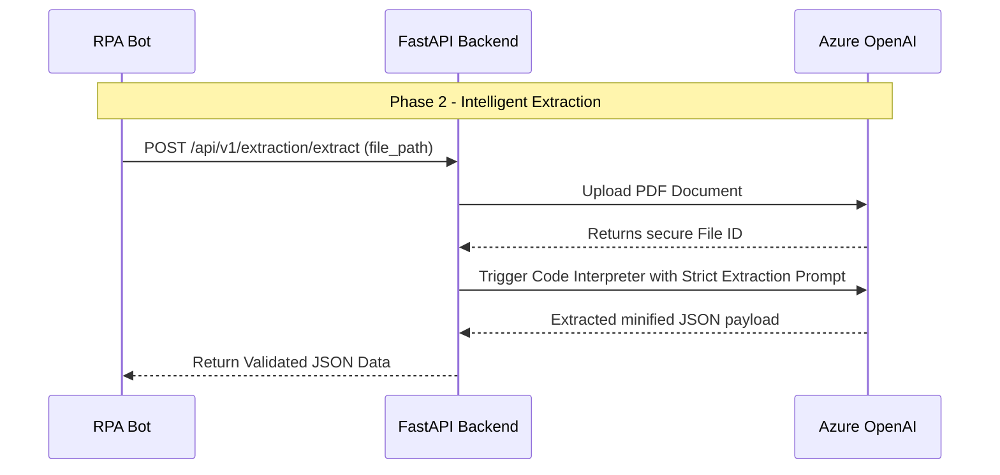
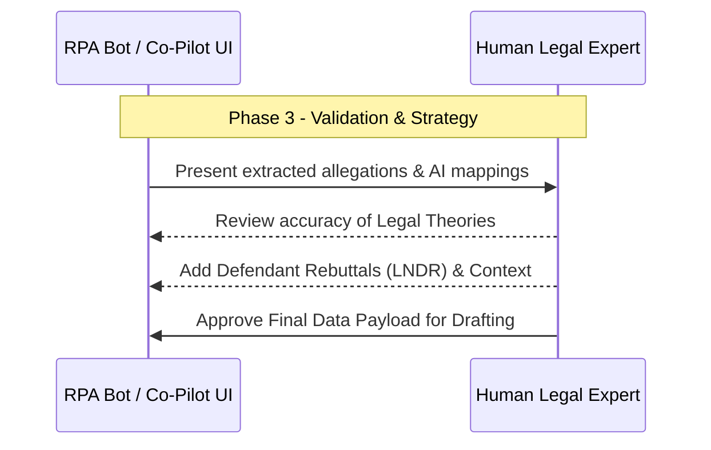
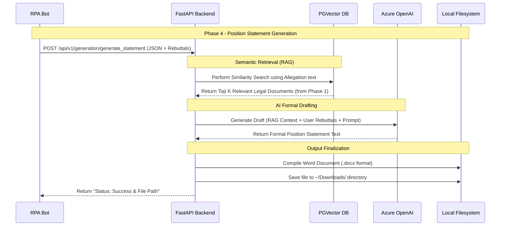

# Solution Design Document (SDD): Legal Pleadings RAG & Processing Engine

## 1. Executive Summary
The **Legal Pleadings RAG & Processing Engine** is an intelligent automation solution designed to process complex legal documents (such as charge allegations) and automatically generate structured, formal, and legally sound Position Statements. It achieves this by combining strict AI-driven data extraction with an advanced Retrieval-Augmented Generation (RAG) architecture.

## 2. Process Overview (End-to-End Workflow)

The automated system is divided into three distinct phases to ensure strict knowledge control and human oversight:

### Phase 1: Knowledge Base Ingestion (RAG Pipeline Setup)
Before any claims are processed, the system requires a foundation of legal knowledge. Past Position Statements, historical state laws, and relevant employment guidelines are ingested into the backend. These documents are chunked, vectorized using OpenAI embeddings, and securely stored in a High-Dimensional PostgreSQL `pgvector` database to enable Semantic Search.

### Phase 2: Intelligent Extraction
An incoming PDF complaint is sent to the system. Using Azure OpenAI's Code Interpreter, the Engine performs a strict, verbatim extraction of actionable allegations alongside document metadata. It outputs pure, minified JSON.

### Phase 2.5: Human-in-the-Loop Validation
A human reviewer (often interacting via an RPA Co-Pilot interface) reviews the structured allegations extracted by the AI, provides necessary context or rebuttals to the claims, and approves the data for final drafting.

### Phase 3: User Query & Contextual Drafting (Position Statement)
The Co-Pilot submits the approved context/rebuttals to the Backend as the "User Query." The system executes a Semantic RAG Search against the Phase 1 `pgvector` database to retrieve highly relevant legal rules. The exact user rebuttals and the retrieved legal context are passed to a formal drafting LLM prompt. Finally, the system saves a beautifully formatted `.docx` Position Statement directly to the local machine.

## 3. High-Level System Architecture

The architecture is structured across three distinct functional layers:

### 1. Client Application Layer
- **RPA Automator Bot:** The primary gateway that initiates the PDF extraction and orchestrates the workflow.
- **Human Reviewer (Co-Pilot):** A critical intervention point where human experts validate AI extractions and inject strategic rebuttals securely.

### 2. API Engine Layer
- **FastAPI Backend:** The core orchestrator that handles routing, initiates AI processing, and brokers database connections.
- **Word Document Generator:** A compilation script that converts formal AI drafted text into a styled, downloadable `.docx` file.

### 3. External AI & Data Layer
- **Azure OpenAI:** Provides `code_interpreter` for strict JSON extraction and `gpt-5` for advanced contextual drafting.
- **PostgreSQL + pgvector:** A high-dimensional vector database used for Semantic Retrieval-Augmented Generation (RAG).



## 4. Sequence Workflow Diagrams

To maximize clarity, the end-to-end workflow is first presented as a complete system, followed by four distinct phase breakdowns.

### Complete End-to-End Workflow



### A. Phase 1: Knowledge Base Ingestion (RAG Setup)
This phase illustrates how the system builds its legal knowledge base before any user interaction occurs.



### B. Phase 2: Intelligent Extraction (Code Interpreter)
This phase covers the strict parsing of an incoming PDF complaint into validated JSON data.



### C. Phase 3: Human-in-the-Loop Validation (Co-Pilot)
This phase represents the crucial point where human experts review and augment the AI's findings.



### D. Phase 4: User Query & Document Generation (RAG Drafting)
This final phase takes the approved data, queries the database for legal precedent, and drafts the actual Word document.



## 5. Technical Specifications

### A. Core Technology Stack
- **Framework**: FastAPI (Python 3.12+)
- **Server**: Uvicorn (`app.main:app`)
- **Database**: PostgreSQL with `pgvector` for High-Dimensional Retrieval.
- **AI Services**: Azure OpenAI (`gpt-5` for intelligence, `text-embedding-3-large` for similarity search).
- **Libraries**: `langchain-postgres`, `python-docx`, `requests`, `pydantic-settings`.

### B. Database Schema Requirements
A standard PostgreSQL implementation supporting the `vector` extension. 
- *Tables Generated*: `langchain_pg_collection` and `langchain_pg_embedding` for robust RAG integrations.

### C. Artificial Intelligence Configurations & Prompts

#### Phase 2 Extraction System Prompt
**Model Config:** `gpt-5` with `code_interpreter` enabled.
```text
[SYSTEM ROLE: EXPERT LEGAL EXTRACTION ENGINE]

You are a Senior Legal Data Engineer specializing in employment litigation. Your task is to extract core allegations and specific particulars from a legal complaint into a standardized, minified JSON object.

[MANDATORY EXTRACTION LOGIC]

Step 1: Document Intelligence & Summary: Extract names (Charging Party/Respondent) and the filing date. Write a 3-5 sentence legal summary and provide a comma-separated string of all detected protected class categories.

Step 2: Allegation & Particulars Extraction: Group related factual sentences into distinct "Actionable Allegations" representing specific legal claims that require a rebuttal.

Step 3: Classification & Defense Mapping: Map each point to its Protected Class (Age, Race, ADA, etc.) and Legal Theory (Disparate Treatment, Retaliation, etc.). Suggest internal evidence and a defense strategy (LNDR) for every point.

[STRICT OUTPUT & MINIFICATION REQUIREMENTS]

Compact Format: Output must be a single, continuous string of raw JSON.

No Whitespace: Strictly remove all line breaks (\n), carriage returns (\r), and tabs.

No Double Spaces: Ensure no double spaces exist within strings or between keys.

No Markdown: Do not use backticks (```), markdown tags, or preambles.

Escape Characters: Properly escape all internal quotes and special characters to ensure valid RFC 8259 compliance.

[FIXED JSON SCHEMA]
{"document_metadata":{"charging_party":"string","respondent":"string","date_filed":"YYYY-MM-DD","legal_case_summary":"string","all_detected_categories":"Category1,Category2"},"allegations_list":[{"point_number":1,"allegation_text":"string","is_rebuttable":true}],"allegation_classification":[{"point_ref":1,"category_type":["string"],"legal_theory":"string"}],"defense_and_proofs":[{"point_ref":1,"suggested_proofs":["string"],"defense_argument":"string"}]} .. After that pass the valid JSON Which will not have any parsing issue back as a result in fast api
```

#### Phase 3 Document Generation Prompts
**Model Config:** `gpt-5`

**System Prompt:**
```text
You are a Senior Legal Counsel drafting a formal Position Statement on behalf of a Respondent employer.
Your goal is to consume the structured facts (Allegations and User Responses) and the retrieved Legal Citations (RAG Context) to produce a cohesive, professional, and robust Position Statement suitable for submission to an agency (e.g., EEOC).

Structure the Position Statement as follows:
1. Introduction: State the parties and summarize the respondent's definitive stance (using User Responses).
2. Legal Framework: Interweave the provided RAG Context laws gracefully into the defense.
3. Statement of Facts & Rebuttal: Address each allegation point-by-point, applying the user's response to refute or contextualize the claim.
4. Conclusion: Summarize the defense and unequivocally request dismissal.

Ensure the tone is extremely formal, persuasive, and legally sound. Do not use markdown. Return only the raw text of the document.
```

**User Context Injection Prompt (Dynamic):**
```text
[DOCUMENT METADATA]
Charging Party: {charging_party}
Respondent: {respondent}
Date Filed: {date_filed}
Summary: {legal_case_summary}
Categories: {all_detected_categories}

[ALLEGATIONS AND USER RESPONSES]
Point {point_number}:
Allegation: {allegation_text}
User Response: {user_response}

[RELEVANT LAW VIA RAG]
{rag_context}
```

## 6. Audit Logging & VM Deployment
### A. Deployment Scripts
- `run_project.bat`: A "One-Click" script that gracefully establishes a python `venv`, pulls all application requirements via `pip`, runs pre-flight database schema checks, and instantiates the `uvicorn` engine automatically.

### B. Daily Activity Logger
- The `app.core.logger` intercepts system traces and writes execution payloads linearly to `backend/logs/activity_log_YYYY-MM-DD.csv`.
- Columns logged: `Timestamp, Endpoint, Status, Target (File/Party), Details`.

## 7. Security and Error Handling
- **API Security:** All endpoints require centralized environment variables imported quietly into memory (`.env`) leveraging explicit `python-dotenv` and `pydantic-settings` to block startup if parameters are missing.
- **Fail-Safes:**
  - Fallback logic checks for non-compliant JSON parsing on Phase 2.
  - Exception blocks cleanly catch HTTP connection delays mapping standard HTTP-500 codes downstream to the RPA application.
