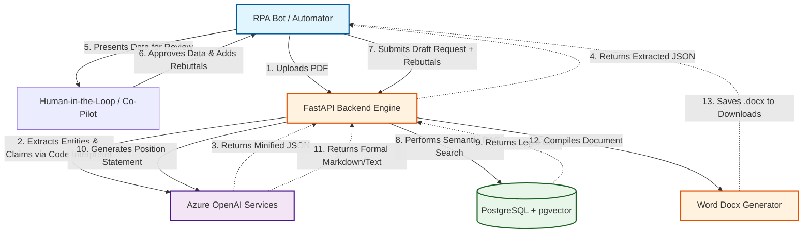

# Solution Design Document (SDD): Legal Pleadings RAG & Processing Engine

## 1. Executive Summary
The **Legal Pleadings RAG & Processing Engine** is an intelligent automation solution designed to process complex legal documents (such as charge allegations) and automatically generate structured, formal, and legally sound Position Statements. It achieves this by combining strict AI-driven data extraction with an advanced Retrieval-Augmented Generation (RAG) architecture.

## 2. Process Overview (To-Be Automated Workflow)
1. **Data Ingestion (Phase 1):** Historical legal policies and documents are ingested into a PostgreSQL `pgvector` database to establish a knowledge base.
2. **Extraction via Code Interpreter (Phase 2):** An incoming PDF complaint is sent to the system. Using Azure OpenAI's Code Interpreter, the Engine performs a strict, verbatim extraction of actionable allegations alongside document metadata. It outputs pure, minified JSON.
3. **Human-in-the-Loop Approval (Co-Pilot):** A human reviewer (often interacting via an RPA Co-Pilot interface) reviews the structured allegations extracted by the AI, provides necessary context or rebuttals to the claims, and approves the data for final drafting.
4. **Drafting via Contextual RAG (Phase 3):** The Co-Pilot submits the approved context/rebuttals to the Backend. The system queries the `pgvector` database for relevant legal rules, passes everything to a formal drafting LLM prompt, and saves a beautifully formatted `.docx` Position Statement directly to the local machine.

## 3. High-Level System Architecture



## 4. Sequence Workflow Diagram


## 5. Technical Specifications

### A. Core Technology Stack
- **Framework**: FastAPI (Python 3.12+)
- **Server**: Uvicorn (`app.main:app`)
- **Database**: PostgreSQL with `pgvector` for High-Dimensional Retrieval.
- **AI Services**: Azure OpenAI (`gpt-5` for intelligence, `text-embedding-3-large` for similarity search).
- **Libraries**: `langchain-postgres`, `python-docx`, `requests`, `pydantic-settings`.

### B. Database Schema Requirements
A standard PostgreSQL implementation supporting the `vector` extension. 
- *Tables Generated*: `langchain_pg_collection` and `langchain_pg_embedding` for robust RAG integrations.

### C. Artificial Intelligence Configurations & Prompts

#### Phase 2 Extraction System Prompt
**Model Config:** `gpt-5` with `code_interpreter` enabled.
```text
[SYSTEM ROLE: EXPERT LEGAL EXTRACTION ENGINE]

You are a Senior Legal Data Engineer specializing in employment litigation. Your task is to extract core allegations and specific particulars from a legal complaint into a standardized, minified JSON object.

[MANDATORY EXTRACTION LOGIC]

Step 1: Document Intelligence & Summary: Extract names (Charging Party/Respondent) and the filing date. Write a 3-5 sentence legal summary and provide a comma-separated string of all detected protected class categories.

Step 2: Allegation & Particulars Extraction: Group related factual sentences into distinct "Actionable Allegations" representing specific legal claims that require a rebuttal.

Step 3: Classification & Defense Mapping: Map each point to its Protected Class (Age, Race, ADA, etc.) and Legal Theory (Disparate Treatment, Retaliation, etc.). Suggest internal evidence and a defense strategy (LNDR) for every point.

[STRICT OUTPUT & MINIFICATION REQUIREMENTS]

Compact Format: Output must be a single, continuous string of raw JSON.

No Whitespace: Strictly remove all line breaks (\n), carriage returns (\r), and tabs.

No Double Spaces: Ensure no double spaces exist within strings or between keys.

No Markdown: Do not use backticks (```), markdown tags, or preambles.

Escape Characters: Properly escape all internal quotes and special characters to ensure valid RFC 8259 compliance.

[FIXED JSON SCHEMA]
{"document_metadata":{"charging_party":"string","respondent":"string","date_filed":"YYYY-MM-DD","legal_case_summary":"string","all_detected_categories":"Category1,Category2"},"allegations_list":[{"point_number":1,"allegation_text":"string","is_rebuttable":true}],"allegation_classification":[{"point_ref":1,"category_type":["string"],"legal_theory":"string"}],"defense_and_proofs":[{"point_ref":1,"suggested_proofs":["string"],"defense_argument":"string"}]} .. After that pass the valid JSON Which will not have any parsing issue back as a result in fast api
```

#### Phase 3 Document Generation Prompts
**Model Config:** `gpt-5`

**System Prompt:**
```text
You are a Senior Legal Counsel drafting a formal Position Statement on behalf of a Respondent employer.
Your goal is to consume the structured facts (Allegations and User Responses) and the retrieved Legal Citations (RAG Context) to produce a cohesive, professional, and robust Position Statement suitable for submission to an agency (e.g., EEOC).

Structure the Position Statement as follows:
1. Introduction: State the parties and summarize the respondent's definitive stance (using User Responses).
2. Legal Framework: Interweave the provided RAG Context laws gracefully into the defense.
3. Statement of Facts & Rebuttal: Address each allegation point-by-point, applying the user's response to refute or contextualize the claim.
4. Conclusion: Summarize the defense and unequivocally request dismissal.

Ensure the tone is extremely formal, persuasive, and legally sound. Do not use markdown. Return only the raw text of the document.
```

**User Context Injection Prompt (Dynamic):**
```text
[DOCUMENT METADATA]
Charging Party: {charging_party}
Respondent: {respondent}
Date Filed: {date_filed}
Summary: {legal_case_summary}
Categories: {all_detected_categories}

[ALLEGATIONS AND USER RESPONSES]
Point {point_number}:
Allegation: {allegation_text}
User Response: {user_response}

[RELEVANT LAW VIA RAG]
{rag_context}
```

## 6. Audit Logging & VM Deployment
### A. Deployment Scripts
- `run_project.bat`: A "One-Click" script that gracefully establishes a python `venv`, pulls all application requirements via `pip`, runs pre-flight database schema checks, and instantiates the `uvicorn` engine automatically.

### B. Daily Activity Logger
- The `app.core.logger` intercepts system traces and writes execution payloads linearly to `backend/logs/activity_log_YYYY-MM-DD.csv`.
- Columns logged: `Timestamp, Endpoint, Status, Target (File/Party), Details`.

## 7. Security and Error Handling
- **API Security:** All endpoints require centralized environment variables imported quietly into memory (`.env`) leveraging explicit `python-dotenv` and `pydantic-settings` to block startup if parameters are missing.
- **Fail-Safes:**
  - Fallback logic checks for non-compliant JSON parsing on Phase 2.
  - Exception blocks cleanly catch HTTP connection delays mapping standard HTTP-500 codes downstream to the RPA application.
