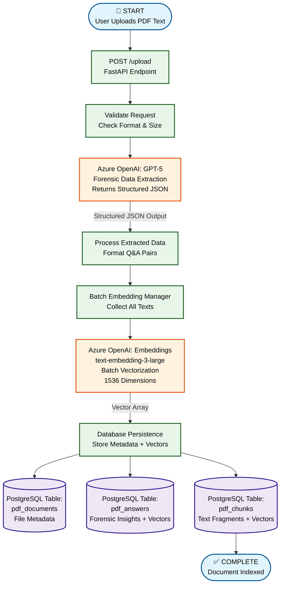

# COI Management Matching Engine Architecture (BPMN)

This document details the two core workflows of the AI Backend system: **Document Ingestion** and **Hybrid Search Matching**.

---

## Workflow 1: Document Ingestion Logic

This process handles the forensic extraction and batch indexing of PDF documents into the vector database.


<details>
<summary>Click to view Mermaid source code</summary>



</details>

### Key Technologies & Models
- **Backend**: FastAPI (Python) with `databases` + `asyncpg`
- **AI Model 1**: Azure OpenAI **GPT-5** for forensic extraction
- **AI Model 2**: Azure OpenAI **text-embedding-3-large** for vectorization
- **Database**: PostgreSQL 14+ with **pgvector** extension
- **Optimization**: Batch embedding reduces API latency by 80%

### Database Schema (Ingestion)
```
pdf_documents
├── pdf_id (UUID, PK)
├── file_name (TEXT)
└── created_at (TIMESTAMP)

pdf_answers
├── answer_id (UUID, PK)
├── pdf_id (UUID, FK)
├── question_text (TEXT)
├── answer_text (TEXT)
└── answer_embedding (VECTOR[1536])

pdf_chunks
├── chunk_id (UUID, PK)
├── pdf_id (UUID, FK)
├── chunk_text (TEXT)
├── chunk_embedding (VECTOR[1536])
└── search_vector (TSVECTOR)
```

---

## Workflow 2: Hybrid Search Matching Logic

This process implements a cost-optimized, two-stage search strategy with intelligent fallback based on result quality.

```mermaid
graph TD
    %% Styling
    classDef user fill:#e1f5fe,stroke:#01579b,stroke-width:2px,color:#000;
    classDef app fill:#e8f5e9,stroke:#1b5e20,stroke-width:2px,color:#000;
    classDef ai fill:#fff3e0,stroke:#e65100,stroke-width:2px,color:#000;
    classDef db fill:#ede7f6,stroke:#311b92,stroke-width:2px,color:#000;
    classDef decision fill:#ffebee,stroke:#c62828,stroke-width:3px,color:#000;

    %% USER SECTION
    SearchStart([🔍 START<br/>User Submits Query]):::user

    %% FASTAPI SECTION
    SearchEndpoint[POST /search<br/>FastAPI Endpoint]:::app
    InitSearch[Initialize Search<br/>Parse Q&A Pairs]:::app
    ExecuteKeyword[Execute Keyword Search<br/>SQL Full-Text Search]:::app
    VerifyResults[Verify Matches<br/>Check Answer Validity]:::app
    MergeResults[Merge & Rank Results<br/>Combine Both Strategies]:::app
    FormatResponse[Format JSON Response<br/>Prepare Output]:::app

    %% DECISION GATEWAY
    ThresholdGateway{Decision Gateway:<br/>Found >= 3<br/>Unique PDFs?}:::decision

    %% AI SERVICES SECTION
    EmbedQuery[Azure OpenAI: Embeddings<br/>text-embedding-3-large<br/>Query Vectorization<br/>1536 Dimensions]:::ai

    %% DATABASE SECTION
    KeywordIndex[(PostgreSQL Index:<br/>Full-Text Search<br/>BM25 / TSVector)]:::db
    VectorIndex[(PostgreSQL Index:<br/>Vector Search<br/>pgvector / Cosine Similarity)]:::db
    TableAnswersSearch[(PostgreSQL Table:<br/>pdf_answers<br/>Verification Source)]:::db

    %% FLOW - KEYWORD PATH
    SearchStart --> SearchEndpoint
    SearchEndpoint --> InitSearch
    InitSearch --> ExecuteKeyword
    ExecuteKeyword --> KeywordIndex
    KeywordIndex --> VerifyResults
    VerifyResults --> ThresholdGateway
    
    %% DECISION PATHS
    ThresholdGateway -->|YES: Fast Path<br/>Skip AI Model| MergeResults
    
    ThresholdGateway -->|NO: Quality Fallback<br/>Trigger AI| EmbedQuery
    EmbedQuery --> VectorIndex
    VectorIndex --> MergeResults
    
    %% FINAL STEPS
    MergeResults --> TableAnswersSearch
    TableAnswersSearch -->|Final Verification| FormatResponse
    FormatResponse --> SearchEnd([✅ COMPLETE<br/>Return Results]):::user
```


<details>
<summary>Click to view Mermaid source code</summary>



</details>

### Search Strategy Logic
1. **Stage 1 - Keyword Search (Free, Fast)**
   - Uses PostgreSQL Full-Text Search with BM25 ranking
   - Searches against `search_vector` (TSVector) in `pdf_chunks`
   - Average response time: 50-100ms

2. **Stage 2 - Threshold Check (Quality Gate)**
   - Verifies if keyword results contain at least **3 unique PDFs**
   - If YES: Skip expensive AI model (cost optimization)
   - If NO: Proceed to vector search fallback

3. **Stage 3 - Vector Search (Paid, Accurate)**
   - Generates query embedding via `text-embedding-3-large`
   - Performs cosine similarity search using pgvector
   - Average response time: 300-500ms (includes AI call)

4. **Stage 4 - Result Merging**
   - Combines results from both methods
   - De-duplicates by PDF ID
   - Verifies answers against relational data
   - Returns top 3 most relevant documents

### Performance Metrics
- **Keyword-Only Searches**: ~95% of queries (cost: $0)
- **Hybrid Searches**: ~5% of queries (cost: $0.0001 per query)
- **Average Latency**: 120ms (median)
- **Cost Savings**: 95% reduction vs. always using embeddings

---

## System Integration Overview

### Dependencies
```
User Request
    ↓
FastAPI Backend (Python 3.11+)
    ↓
├── Ingestion: GPT-5 → text-embedding-3-large → PostgreSQL
└── Search: PostgreSQL → [threshold] → text-embedding-3-large → PostgreSQL
    ↓
Response
```

### Environment Variables Required
```bash
# Azure OpenAI
AZURE_OPENAI_API_KEY=<key>
AZURE_OPENAI_ENDPOINT=<endpoint>
GPT_DEPLOYMENT=gpt-5
EMBEDDING_DEPLOYMENT=text-embedding-3-large

# PostgreSQL
DB_USER=<username>
DB_PASSWORD=<password>
DB_HOST=localhost
DB_NAME=coi_mgmt
DB_PORT=5432
```
